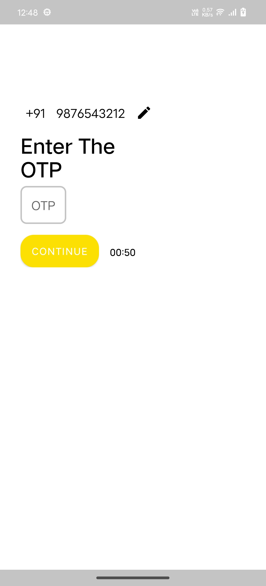
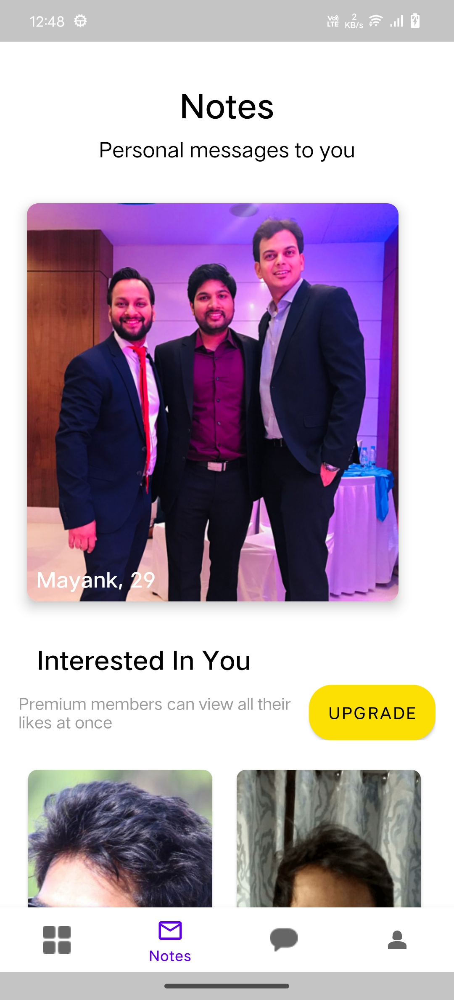

# Aisle Assignment App


## Project 1

### Problem 
Aisle has millions of users from over 150 countries. Each user gets 10 free daily.

Likes. Unused Likes are not carried forward to the next day. We must refresh the number of daily Likes at 12:00 pm according to the user's local time.
How would you go about doing this in a scalable way?

### Proposed Solution

- User Profile Management:

  - Each user should be associated with a unique profile stored in the database. The profile contains essential user information such as a user ID, email, likes count, time zone, and the timestamp of their last Likes refresh.

- Daily Likes Refresh Process:

    - A cron job or a scheduled task should be set up on the server to run daily at 12:00 pm UTC (Coordinated Universal Time) or be adjusted according to the server's configured time zone.
    - The scheduled task will trigger the daily likes refresh for all users. It will fetch all user profiles from the database and perform the necessary updates to reset their likes count to 10 at the specified refresh time.
    - For users who have already used their daily likes, their likes count will be reset to 0, effectively refreshing their daily likes quota for the new day.

- Time Zone Conversion:

  - Since Aisle has users from over 150 countries, it is crucial to cater to users across different time zones.
  - To achieve this, the server's timestamp will be converted to each user's local time based on their specified time zone. This ensures that the daily likes reset occurs uniformly at 12:00 pm in each user's local time zone, irrespective of their geographic location.

- Scalability and High Availability: 
  - Cloud-based infrastructure like AWS allows automatic scaling based on demand. Multiple server deployments could be used to ensure continuous service availability.


## Project 2

This is an Android application that demonstrates a sample implementation of an app that allows users to perform phone number login, verify OTP, and display notes data.

### Table of Contents
- [DEMO](#demo-video)
- [Features](#features)
- [Technologies Used](#technologies-used)
- [Installation](#installation)
- [Usage](#usage)
- [API Endpoints](#api-endpoints)
- [Screenshots](#screenshots)
- [Contributing](#contributing)


### Demo Video

Check out this video to see a demo of the app:

### Features

- Phone Number Login: Users can enter their phone number and initiate a login process.
- OTP Verification: After entering the phone number, users have to enter OTP to verify their identity.
- Display Notes: Once the user is verified, the app fetches notes data and displays it in the app.

### Technologies Used

- Kotlin: The app is developed using Kotlin, a modern programming language for Android.
- Android Architecture Components: ViewModel, LiveData, Navigation Component, etc., for building robust and maintainable apps.
- Koin: Dependency injection framework for managing app dependencies.
- Retrofit: For making API requests and handling network calls.
- Moshi: JSON parsing library for converting JSON responses from the server to Kotlin objects.
- Gson: Another JSON parsing library for handling JSON data.
- Coroutines: For asynchronous programming and managing background tasks efficiently.
- Glide: Image loading library for loading and displaying images in the app.
- Material Components: To ensure a consistent and modern user interface.
- ConstraintLayout: For creating flexible and responsive UI layouts.

### Installation

To run this project on your local machine, follow these steps:

1. Clone this repository to your local machine using the following command:

```
git clone https://github.com/ajitpatel/AisleAssignment.git
```

2. Open Android Studio and navigate to the project directory.

3. Build and run the app on an Android emulator or a physical device.

### Usage

1. Launch the app on your Android device.
2. On the phone number login screen, enter your phone number with the country code and click on "Continue."
3. Enter the OTP and click on "Continue."
4. If the verification is successful, you will be navigated to the Notes screen.
5. The Notes screen displays the data fetched from the API in the form of Invites and Likes sections.

#### Note
This API returns a true response only for the test number and OTP, so please try with the given test values:

- Country Code: ````+91````
- Mobile Number: ````9876543212````
- OTP: ````1234````

### API Endpoints

The app communicates with the backend API using the following endpoints:

- **Phone Number API**
  - Method: POST
  - Base URL: https://app.aisle.co/V1
  - End Point: /users/phone_number_login
  - Parameters: {'number' = "+919876543212"}
  - Example Response: 
    ```
    {
      "status": true,
    }
    ```

- **OTP API**
  - Method: POST
  - Base URL: https://app.aisle.co/V1
  - End Point: /users/verify_otp
  - Parameters: {'number' = "+919876543212", 'otp' => "1234"}
  - Example Response: 
    ```
    {
      "token": 234567yghfdskeryr920weruf
    }
    ```

- **Notes API**
  - Method: GET
  - Base URL: https://app.aisle.co/V1
  - End Point: /users/test_profile_list
  - Header: {'Authorization' = 'auth_token'}
  - Example Response:
    ```
    {
    invites={
        profiles=[
            {
                general_information={
                    date_of_birth=1993-02-11,
                    date_of_birth_v1=11th February 1993,
                    location={
                        summary=IN, Rampur, full=Rampur, Uttar Pradesh, IN
                    },
                    drinking_v1={
                        id=6.0,
                        name=Drinks Occasionally,
                        name_alias=Drinks Occasionally
                    },
                    first_name=Mayank,
                    gender=Male,
                    marital_status_v1={
                        id=9.0,
                        name=Single,
                        preference_only=false
                    },
                    ref_id=1C76E221,
                    smoking_v1={
                        id=2.0,
                        name=Non-Smoker,
                        name_alias=Non-Smoker
                    },
                    sun_sign_v1={
                        id=2.0,
                        name=Aquarius
                    },
                    mother_tongue={
                        id=2.0,
                        name=Hindi
                    },
                    faith={
                        id=6.0,
                        name=Hindu
                    },
                    height=62.0,
                    cast=null,
                    kid=null,
                    diet=null,
                    politics=null,
                    pet=null,
                    settle=null,
                    mbti=null,
                    age=29.0
                },
                approved_time=1.620885330138944E9,
                disapproved_time=1.6179514025616488E9,
                photos=[
                    {
                        photo=https://testimages.aisle.co/f39552690128813a6e893b4f4cd725fc729869938.png,
                        photo_id=130633.0,
                        selected=true,
                        status=avatar
                    },
                    {
                        photo=https://testimages.aisle.co/2cb58925723382f002ba3f4d8f573011729866682.png,
                        photo_id=130632.0,
                        selected=false,
                        status=null
                    }
                ],
                user_interests=[],
                work={
                    industry_v1={
                        id=13.0,
                        name=Information Technology,
                        preference_only=false
                    },
                    monthly_income_v1=null,
                    experience_v1={
                        id=5.0,
                        name=6 Years Experience,
                        name_alias=6 Years Experience
                    },
                    highest_qualification_v1={
                        id=1.0,
                        name=Bachelors,
                        preference_only=false
                    },
                    field_of_study_v1={
                        id=2.0,
                        name=Engineering
                    }
                },
                preferences=[
                    {
                        answer_id=32669.0,
                        id=10.0,
                        value=0.0,
                        preference_question={
                            first_choice=Indoor,
                            second_choice=Outdoor
                        }
                    },
                    {
                        answer_id=32671.0,
                        id=15.0,
                        value=0.0,
                        preference_question={
                            first_choice=Indie,
                            second_choice=Mainstream
                        }
                    },
                    {
                        answer_id=32670.0,
                        id=21.0,
                        value=0.0,
                        preference_question={
                            first_choice=Logical,
                            second_choice=Emotional
                        }
                    },
                    {
                        answer_id=32668.0,
                        id=2.0,
                        value=1.0,
                        preference_question={
                            first_choice=Adopt,
                            second_choice=Conceive
                        }
                    },
                    {
                        answer_id=32667.0,
                        id=20.0,
                        value=1.0,
                        preference_question={
                            first_choice=Creationist,
                            second_choice=Evolutionist
                        }
                    }
                ],
                instagram_images=null,
                last_seen_window=2021-05-21T06:21:15.056Z,
                is_facebook_data_fetched=false,
                icebreakers=null,
                story=null,
                meetup=null,
                verification_status=verified,
                has_active_subscription=false,
                show_concierge_badge=false,
                lat=28.79,
                lng=79.02,
                last_seen=null,
                online_code=0.0,
                profile_data_list=[
                    {
                        question=Philosophy,
                        preferences=[
                            {
                                answer_id=32669.0,
                                answer=Indoor than Outdoor,
                                first_choice=Indoor,
                                second_choice=Outdoor
                            },
                            {
                                answer_id=32671.0,
                                answer=Indie than Mainstream,
                                first_choice=Indie,
                                second_choice=Mainstream
                            },
                            {
                                answer_id=32670.0,
                                answer=Logical than Emotional,
                                first_choice=Logical,
                                second_choice=Emotional
                            },
                            {
                                answer_id=32668.0,
                                answer=Conceive than Adopt,
                                first_choice=Conceive,
                                second_choice=Adopt
                            },
                            {
                                answer_id=32667.0,
                                answer=Evolutionist than Creationist,
                                first_choice=Evolutionist,
                                second_choice=Creationist
                            }
                        ],
                        invitation_type=preference
                    }
                ]
            }
        ],
        totalPages=1.0,
        pending_invitations_count=1.0
    },
    likes={
        profiles=[
            {
                first_name=Ajith,
                avatar=https://testimages.aisle.co/dd510d5260eeebcdc7d7fc752c598c39728894004.png
            },
            {
                first_name=Ishant,
                avatar=https://testimages.aisle.co/58b125e52d319c0390fc2d68b7da2ba6729804903.png
            }
        ],
        can_see_profile=false,
        likes_received_count=2.0
    }
}


### Screenshots

- **Phone Number Screen**


- **Otp Screen**


- **Notes Screen**



## Contributing

Contributions are welcome! If you find any issues or have ideas to improve the app, feel free to create a pull request or open an issue.
